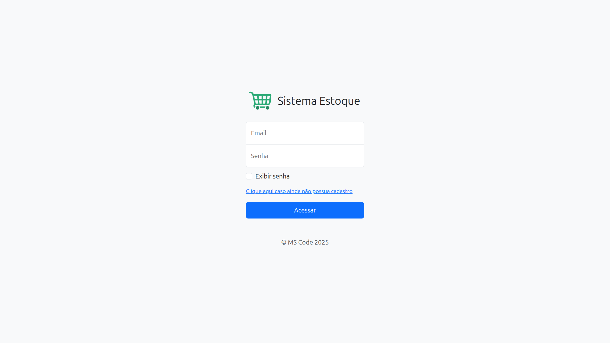
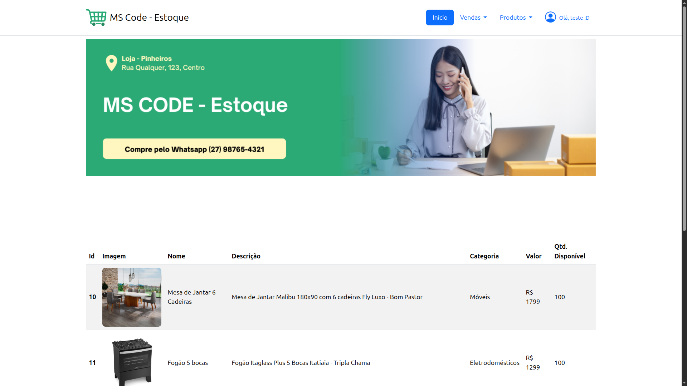
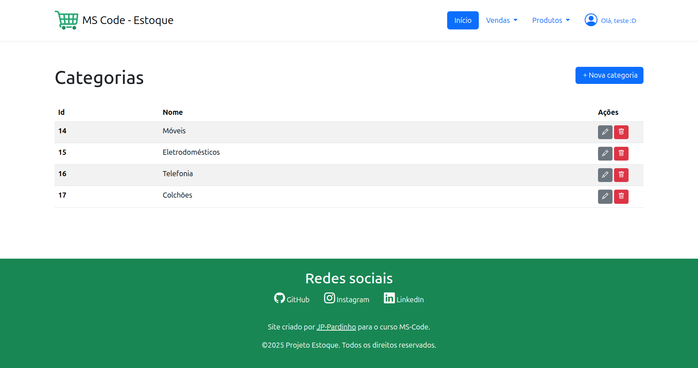
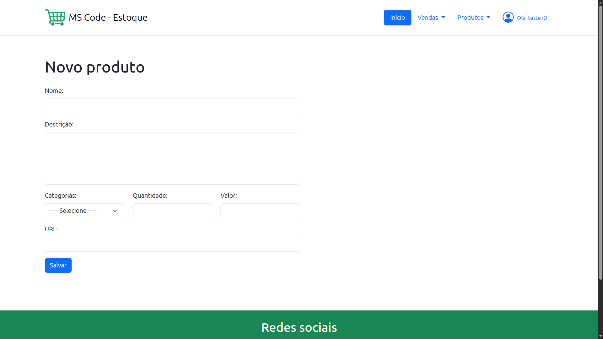
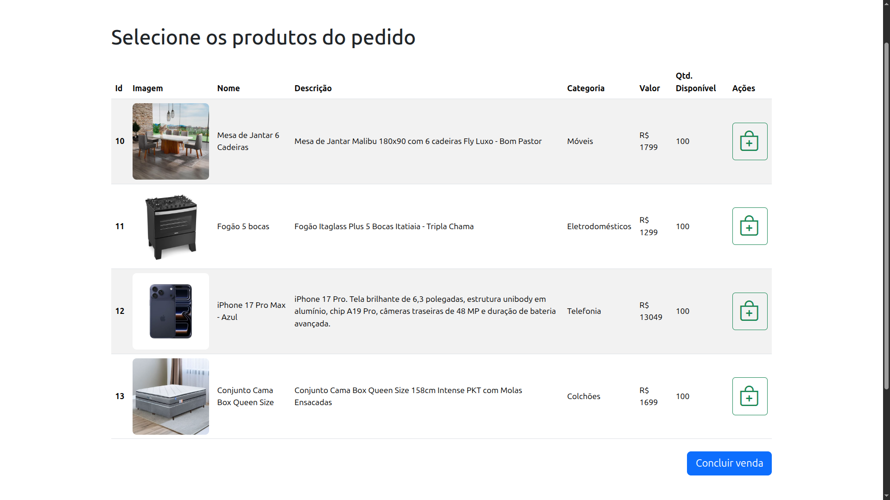
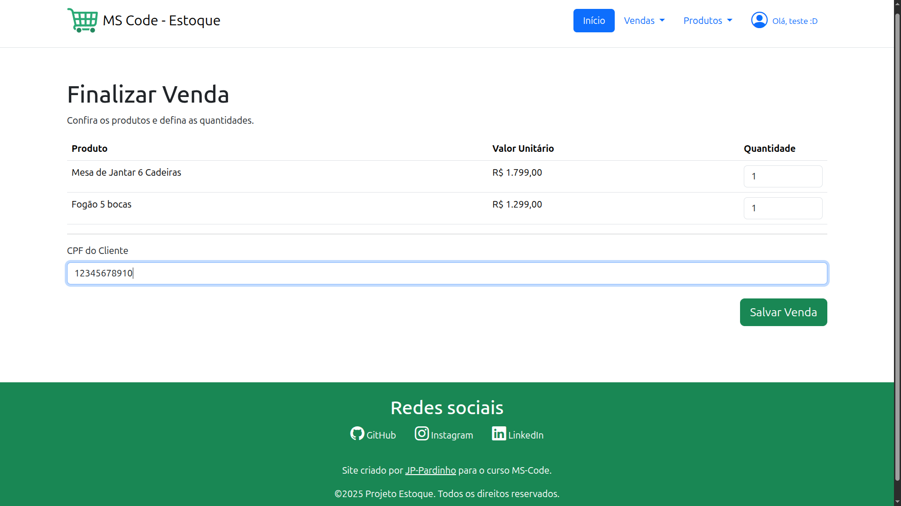
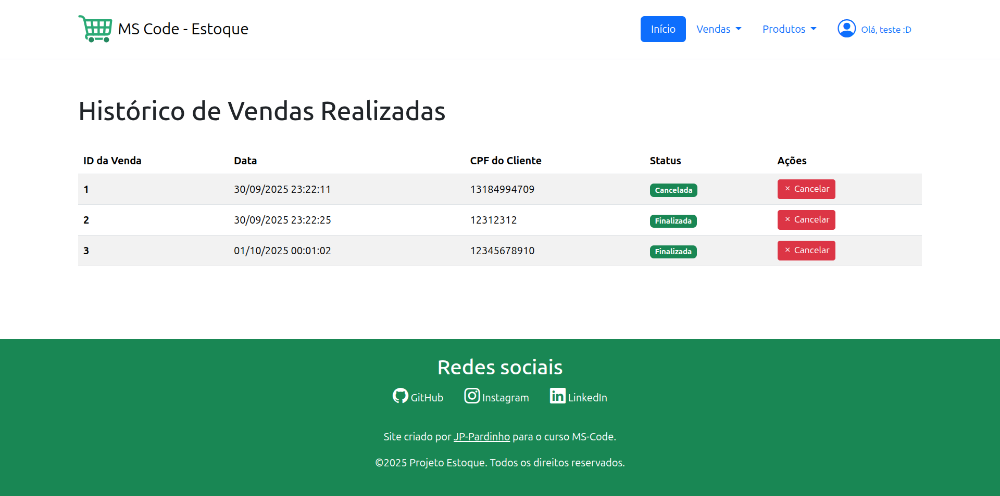
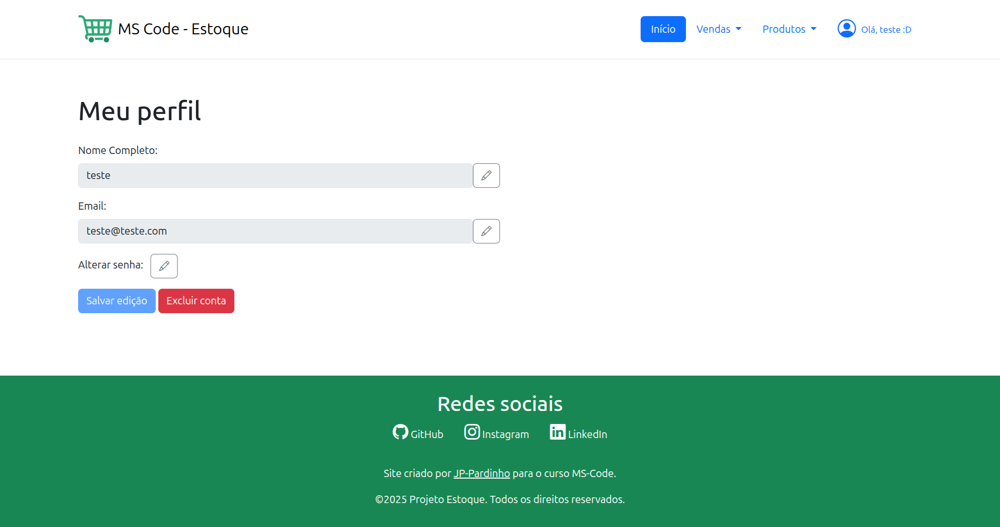

# Controle de Estoque e Vendas

Este é um sistema simples para controle de estoque e registro de vendas, feito com PHP e Bootstrap.

**Status:** Em desenvolvimento.

---

## Feito com

-   PHP
-   MySQL
-   Bootstrap 5
-   HTML / CSS / JS

---

## Principais Telas e Funções

O projeto foi pensado para ser uma ferramenta prática para um vendedor. Abaixo estão as principais telas do sistema.

#### 1. Tela de Login
Página de entrada para autenticação do usuário e acesso ao sistema.



#### 2. Página Inicial e Listagem de Produtos
Tela principal que exibe um banner e a lista de todos os produtos disponíveis no estoque.



#### 3. Gestão de Categorias
Permite ao administrador criar, visualizar, editar e excluir as categorias dos produtos.



#### 4. Formulário de Novo Produto
Tela utilizada para cadastrar um novo produto no sistema, definindo nome, descrição, categoria, quantidade, valor e imagem.



#### 5. Tela de Nova Venda
Interface onde o vendedor inicia uma nova venda, selecionando os produtos desejados da lista para adicionar ao pedido.



#### 6. Tela de Finalização de Venda
Após selecionar os produtos, esta tela permite ao vendedor definir a quantidade de cada item, informar o CPF do cliente (opcional) e confirmar a venda, atualizando o estoque.



#### 7. Tela de Histórico de Vendas
Exibe uma lista de todas as vendas já realizadas. Daqui, é possível cancelar uma venda, ação que devolve os produtos ao estoque.



#### 8. Tela de Perfil do Usuário
Área onde o usuário pode visualizar e editar suas informações, como nome, email e senha.



---

## Como Rodar o Projeto

1.  **Pré-requisitos:**
    -   Você precisa ter o [PHP](https://www.php.net/downloads) e o [MySQL](https://dev.mysql.com/downloads/installer/) instalados na sua máquina.

2.  **Clone o Repositório:**
    -   Abra seu terminal ou Git Bash e clone este projeto.
      
3.  **Banco de Dados:**
    -   Crie um banco de dados no seu MySQL com o nome `mscode_estoque2025`.
    -   Importe o arquivo `criar-tabelas.sql` para dentro desse banco de dados.
    -   Ajuste suas credenciais (usuário e senha) no arquivo de conexão `App/Database/Query.php`.

4.  **Inicie o Servidor:**
    -   Ainda no terminal, na raiz do projeto, execute o seguinte comando:
    ```bash
    php -S localhost:8081 -t public
    ```
    -   *Este comando inicia o servidor do PHP na porta `8081` e define a pasta `public` como o diretório raiz, uma prática recomendada para segurança.*

5.  **Acesso:**
    -   Abra seu navegador e acesse: **http://localhost:8081**

---

## Autor

João Pedro Pardinho Rodrigues
